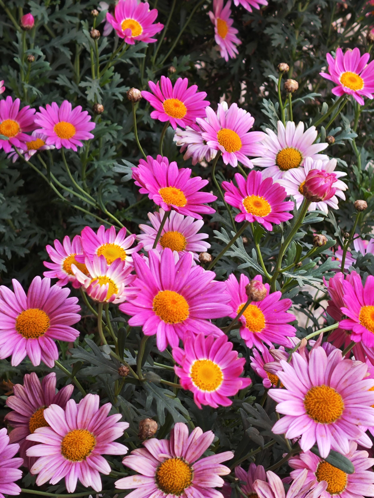

# 篇二

### 序

写下这篇文字，对于我来说极为的艰难，我不知道该如何开始落笔，这是我内心最隐秘、最不愿触及的角落。如上篇所示，此篇的内容将和感情经历有关，我也不得不去面对这个课题，把那些隐秘的、难以启齿的、甚至肮脏的毫无保留的摆在桌面上来，赤裸裸地站在这里，接受所有的嘲笑或是评论，我只希望此刻开始，我能诚实地面对自己不堪的、阴暗的一面。

提到感情，无可避免要触及的一个部分那就是——**性**。

对于中国人来说，往往谈“性”色变，却又是最趋之若鹜般地痴迷其存在。受封建礼仪的教化规训，“性”似乎成了一种禁忌般存在，大家似乎都心知肚明，但大家都不是很愿意拿出来讨论，而且拿出来讨论给人一种“龌龊”感、油腻感和羞耻之心，有时是可行不可言说之物，有时“一谈到男女之事，马上就兴奋”，表面上强调道德礼仪，背地里也不乏鸡鸣狗盗，这是中国人普遍存在的矛盾和反差，这种压抑让人感觉表里不一且虚伪至极，而我们也被这种文化所影响着和塑造着，边鄙夷边被牵引着。

其实从客观的角度分析，“性”是生物繁衍的本能行为，而人也是唯一能从性里获取快感的动物。可文化的影响和传承比想象中的更加强大，“食色性也”，那为什么我们不能像看待衣食住行般去面对“性”这个问题？而更喜欢偷偷摸摸地，似乎这就是见不得光的一部分。对于我自己而言，我也实在做不到谈论“性”的问题如吃饭喝水般简单，也不喜欢去谈论它，但同时我是接受它的。我为什么会感到羞耻呢？同时我似乎也痴迷于此，却又非常反感有人和我讨论它，这是长期以来困扰我的一个部分。

在十多岁的时候，我便亲眼目睹了父母做爱的场景，那样的情景是如此的真实，我能清晰地看到和感受到阴部抽插时的冲动，以及做爱之时呻吟的快感，对于一个没有被正确“性”教育的孩子来说，这绝对是一种灾难，这是很难启齿的一部分，在很小的时候，目睹这样的场景，在某次不经意地触碰和摩擦，第一次感受到了射出时的快感，从此一发便不可收拾，加上原本压抑动荡的环境，总能找到“慰藉“相关的物品，“指头告了消乏”是常有的事情，我不仅依赖于酒精，还沉迷于“自慰”，无法自拔，每次之后都会有愧疚的心理，我讨厌着自己，同时又无法控制自己，同时又痴迷于此，这是我心有所愧、难以言说却又真实的部分，甚至不想去承认的部分。

---

### 初恋

关于初恋，是我内心最隐秘角落里最隐秘的存在，我从未跟任何人真实地谈论过。

我是在小学三年级的时候，第一次感觉到自己对一个人有爱的感觉的，或许说爱太早，但起码说喜欢一点也不过分。当时一二年级刚结束，有一批从村级小学合并过来的同学加入了我们学校，第一次与她照面的那天，我记得自己穿着一件橙色且纯的衬衫，我喜欢将袖子卷起来露出小臂，但我也不太记得是短袖口还是长袖了，但颜色一定是这个。我和同村伙伴一起来到了学校，走进空荡荡的教室，黑板上板正的书写着许多人的名字，我们自然地在找着各自的名字在哪。我找到了自己的名字，同时也在浏览着其他名字，念到其中一个名字的时候，我突然停了下来，不知怎么，心里顿了一下，“JSM”，这是一种奇妙的感觉，可我也无法言说那种感觉，好像有种即将到来、又似曾相识的微妙。当第一次看到她的时候，我不知道为什么，我就是知道，黑板上的那个名字，就是此刻眼前的这个女孩，她穿着一件白色衬衣，领口和袖口都有花纹般的装饰，白色的外侧还有天蓝色相衬，她五官端正、仪态斯文不缺活力，鼻梁上有一颗浅浅的黑痣，扎着一头马尾辫，看起来很高，身材中等偏瘦，就一眼，我看到她就想到了那个停留的名字，内心像是被闪电击中的感觉，虽然我不知道这是什么，后来我确切的知道，这就是一见钟情，我喜欢她，很多年后依然如此。结合当时的处境和性格，自然而然一段关于暗恋无果的单相思就此开始了。

---

我不想写下去了，这些过往对我已经不再重要，我也彻底放下了，在写这些过往的人和事的时候，我心里在想的全是你(reaewong)，我难过的也是你，写着这些文字，每写着一句话我的内心都像在滴血，我躲进厕所哭了，边抽着烟边感到难过，我只知道，我心里的人就是你，即使我们的结果已经不能再改变，我会远远站在另一个位置，祝福你,reaewong,我真正爱的人是你。

尽管你并不会知道。

> `2026-8-8 23:08`

---

不知道为什么，当我觉得自己爱的人就是你的那一刻起，我发现我终于可以放下你了，是的，我终于可以放下你了。写着写着，我才终于意识到，那些过往对我一点都不重要，我也不再只是那个不堪的我，我完全可以重新塑造自己，我把自己最不堪的一面写出来，就是为了直面这些过去。

reaewong,我有无数次想过再联系你，可我发现那只会让你感觉到不舒服，包括8月7日晚上，在烧烤摊对面，你是背对着我的，从赵老师的神态看起来，你应该看到了我，我不知道你的内心是什么样的，我甚至不敢多看你一眼，蓝色牛仔裤和白色衬衫外表，站得笔直，外表平静，而赵老师脸上好像感受到了担忧。**过去我总是喜欢去一探究竟，寻求肯定，去解释，慢慢的我学会让一些东西适可而止的停下就放置在那**，我很喜欢去推断一些东西，我慢慢的学着去感受多一点，在感情的世界里总是着力即差，对方的一言一行总是牵动着另一方的心弦，而我们也是在同走过的一段路途中的互相照见，其间发生了很多错位误解，一个AM、一个FM,短暂交汇已是上上签。其他的东西，交给时间和天意吧，我把你送我的祝福同样送给你：

> **“嘿!不必执着于生命的意义，愿你生活鲜动！”**

> `我很抱歉，我们不仅错过了彼此，还有可能在每一次错过中，慢慢错过了那个充满赤诚、满心欢喜的自己。`

---

### The end, to myself:

> "One day, you are gonna wake up, eat your cereal, brush your teeth. And at some point, you're gonna realize you haven't thought about it for a while. That's when you know you can forget. With time, it gets easier."
>
> 【 “有一天，你会醒来，去刷牙，去准备你的早餐。突然间，你会发现自己有一阵子没去想这件事了。就是在那一刻，你意识到你可以忘记它。随着时间的推移，想起来的时间会越来越少。直到有一天，你真的能够把它放下。”】

> `2026-8-9 18：37`
